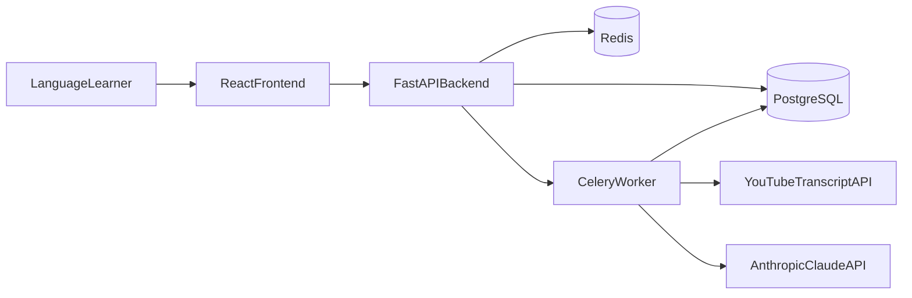
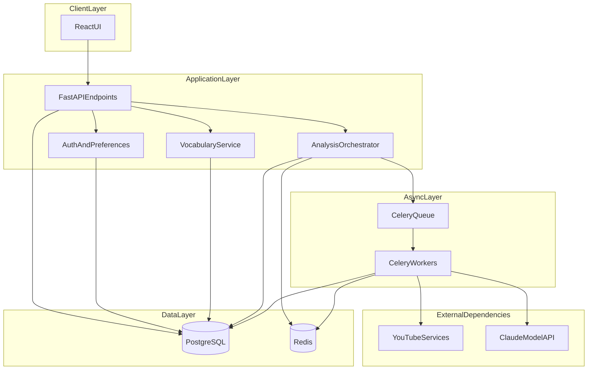
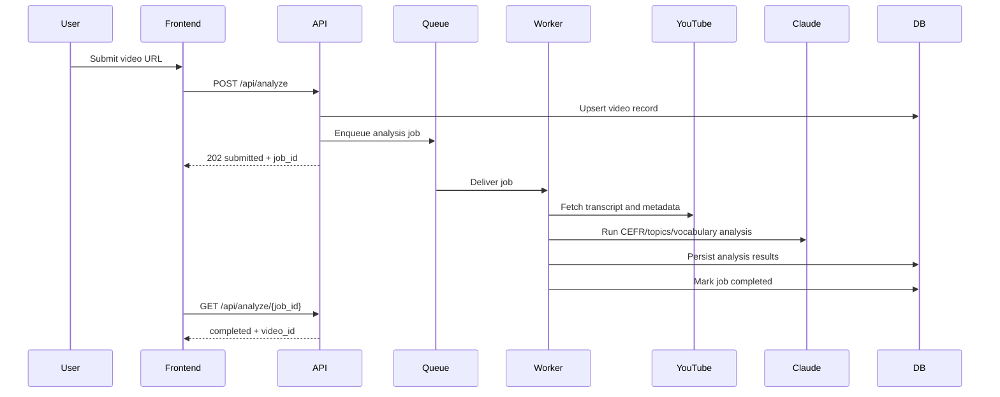
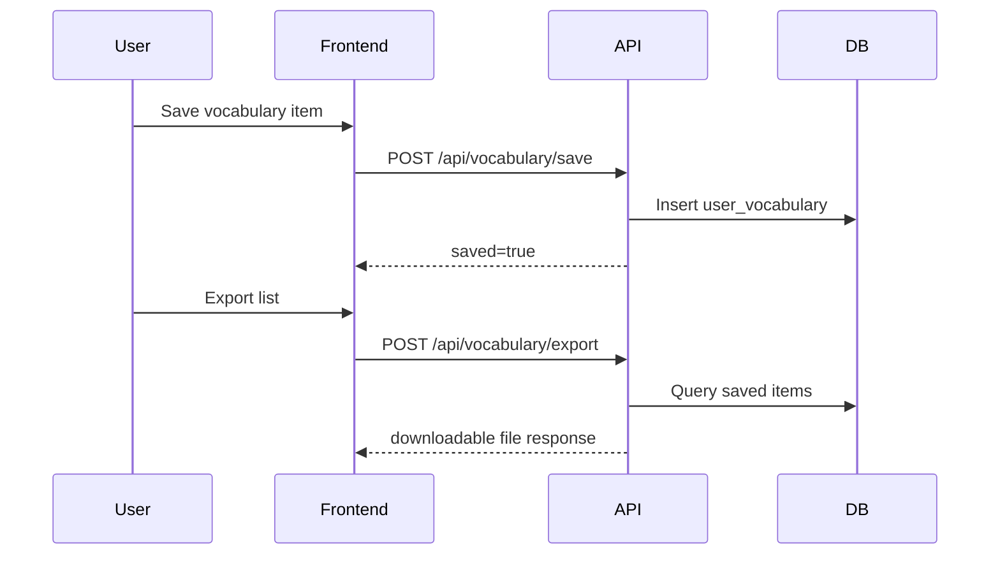

# System Architecture (MVP)

## 1. System Context

## 2. Container/Component View

## 3. Sequence: Async Transcript + Analysis Flow

## 4. Sequence: Save Vocabulary and Export

## 5. Architectural Principles
- API contract-first before implementation.
- Asynchronous processing for long-running transcript/AI operations.
- Data integrity through explicit constraints and idempotent writes.
- Observability and failure transparency across async boundaries.
- Feature traceability from requirements to components and tests.
