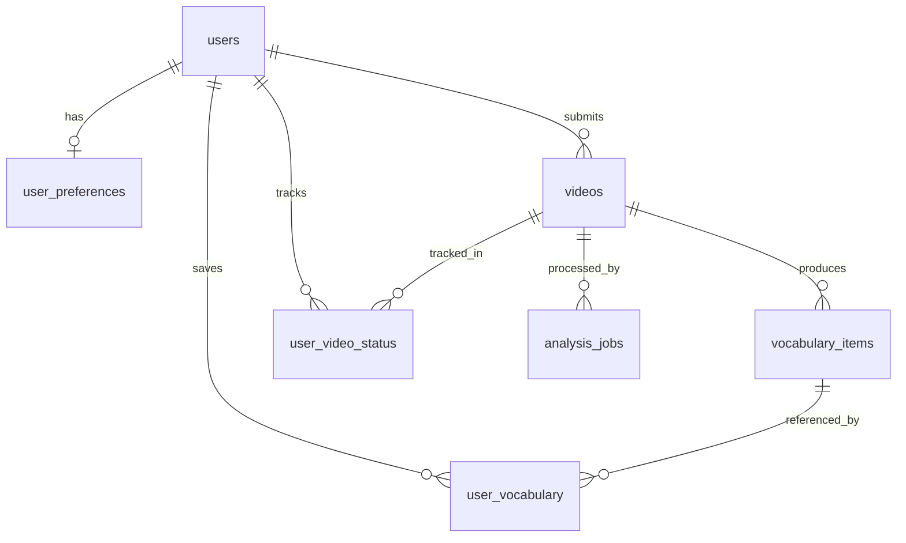

# Data Model (Canonical, MVP)

## 1. Model Overview
Core entities:
- `users`
- `user_preferences`
- `videos`
- `analysis_jobs`
- `vocabulary_items`
- `user_vocabulary`
- `user_video_status`

## 2. ERD (Logical)

## 3. Entities and Constraints

## 3.1 `users`
- `id` PK
- `email` VARCHAR(255) UNIQUE NOT NULL
- `password_hash` TEXT NOT NULL
- `created_at` TIMESTAMP NOT NULL default now
- `updated_at` TIMESTAMP NOT NULL default now

## 3.2 `user_preferences`
- `id` PK
- `user_id` FK -> users.id UNIQUE NOT NULL
- `target_language` VARCHAR(10) NOT NULL
- `current_level` VARCHAR(3) NOT NULL CHECK in (`A1`,`A2`,`B1`,`B2`,`C1`,`C2`)
- `interests` JSONB NOT NULL default `[]`
- `updated_at` TIMESTAMP NOT NULL

## 3.3 `videos`
- `id` PK
- `youtube_id` VARCHAR(20) UNIQUE NOT NULL
- `submitted_by_user_id` FK -> users.id NULL
- `title` VARCHAR(500) NOT NULL
- `language` VARCHAR(10) NOT NULL
- `duration_seconds` INTEGER NULL
- `views` BIGINT NULL
- `cefr_level` VARCHAR(3) NULL CHECK CEFR enum
- `confidence` FLOAT NULL CHECK (`confidence >= 0 AND confidence <= 1`)
- `topics` JSONB NOT NULL default `[]`
- `transcript_text` TEXT NULL
- `analyzed_at` TIMESTAMP NULL
- `created_at` TIMESTAMP NOT NULL
- `updated_at` TIMESTAMP NOT NULL

## 3.4 `analysis_jobs`
- `id` PK
- `job_id` VARCHAR(40) UNIQUE NOT NULL
- `video_id` FK -> videos.id NOT NULL
- `status` VARCHAR(20) NOT NULL CHECK in (`submitted`,`processing`,`completed`,`failed`)
- `retry_count` INTEGER NOT NULL default 0
- `failure_reason` TEXT NULL
- `submitted_at` TIMESTAMP NOT NULL
- `started_at` TIMESTAMP NULL
- `completed_at` TIMESTAMP NULL

## 3.5 `vocabulary_items`
- `id` PK
- `video_id` FK -> videos.id NOT NULL
- `word` VARCHAR(255) NOT NULL
- `translation` VARCHAR(255) NOT NULL
- `cefr_level` VARCHAR(3) NOT NULL CHECK CEFR enum
- `frequency` VARCHAR(20) NOT NULL CHECK in (`once`,`common`,`very common`)
- `example_sentence` TEXT NOT NULL
- `created_at` TIMESTAMP NOT NULL
- UNIQUE (`video_id`, `word`, `example_sentence`)

## 3.6 `user_vocabulary`
- `id` PK
- `user_id` FK -> users.id NOT NULL
- `vocabulary_id` FK -> vocabulary_items.id NOT NULL
- `saved_at` TIMESTAMP NOT NULL
- `in_anki` BOOLEAN NOT NULL default false
- UNIQUE (`user_id`, `vocabulary_id`)

## 3.7 `user_video_status`
- `id` PK
- `user_id` FK -> users.id NOT NULL
- `video_id` FK -> videos.id NOT NULL
- `watched` BOOLEAN NOT NULL default false
- `watched_at` TIMESTAMP NULL
- UNIQUE (`user_id`, `video_id`)

## 4. Index Plan
- `videos(youtube_id)` unique index.
- `videos(language, cefr_level)` composite filter index.
- `videos USING gin(topics)` for topic filtering.
- `vocabulary_items(video_id, cefr_level)` for detail + filter views.
- `analysis_jobs(job_id)` unique lookup.
- `analysis_jobs(video_id, status)` operational monitoring.
- `user_vocabulary(user_id, saved_at DESC)` saved list pagination.
- `user_video_status(user_id, watched)` watched filters.

## 5. Validation Rules
- CEFR values only `A1..C2`.
- Confidence always within `[0.0, 1.0]`.
- Vocabulary extraction cardinality per video: 20-30.
- Topic tags cardinality per video: 3-5.
- Transcript minimum length threshold enforced before analysis.
- Job state transitions limited to defined workflow.

## 6. Migration Notes
- Current backend models require expansion for:
  - `analysis_jobs`
  - `user_preferences`
  - `user_video_status`
  - additional metadata fields (`language`, `duration_seconds`, `views`)
- Add migration scripts with forward and rollback notes before implementation.
